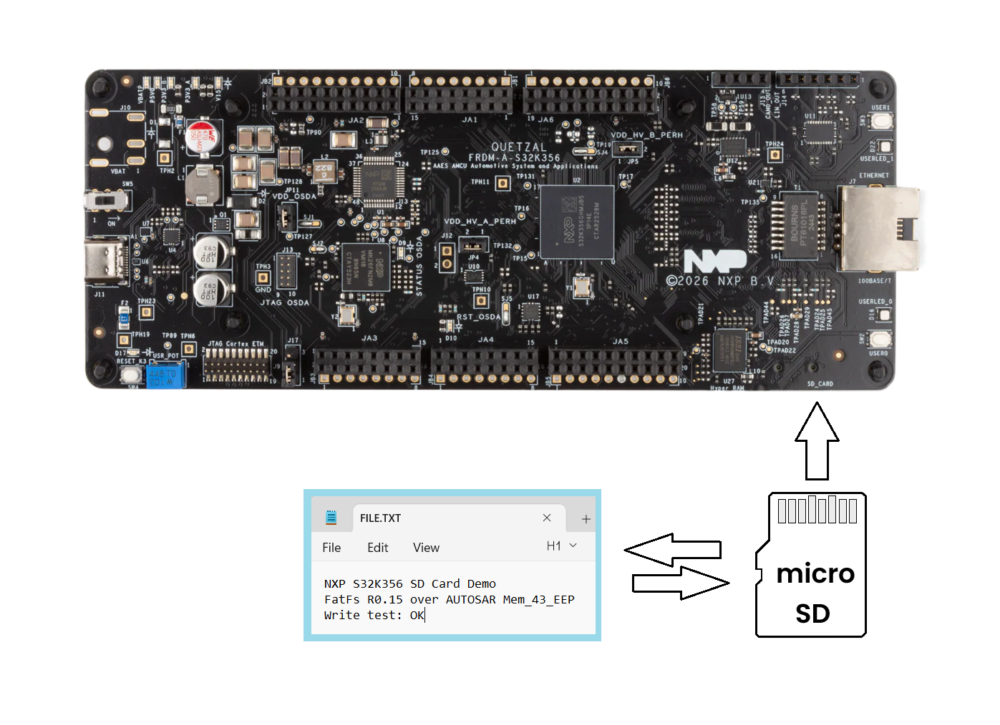
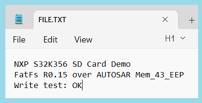

# NXP Application Code Hub

## Write a file to microSD Card
This example uses the FatFs R0.15 filesystem layered over the AUTOSAR RTD `Mem_43_EEP` driver (uSDHC) to write a file.txt to a microSD card on the FRDM-A-S32K356. It mounts a pre-formatted FAT16/FAT32 volume, creates a file in the root directory, writes a short text string, then safely closes and unmounts the card so the file is readable on a PC. Onboard RGB LEDs indicate the result (green = success, red = error).
[

](./images/FRDM-A-S32K356_MicroSD.png)

#### Boards: FRDM-A-S32K356
#### Categories: SDMMC
#### Peripherals: SDMMC, SIUL2, SDIO
#### Toolchains: S32 Design Studio IDE

## Table of Contents
1. [Software and Tools](#step1)
2. [Hardware](#step2)
3. [Setup](#step3)
4. [Results](#step4)
5. [Support](#step5)
6. [Release Notes](#step6)

## 1. Software and Tools
This example was developed using the FRDM Automotive Bundle for S32K3 + S32M27. To download and install the complete software and tools ecosystem, use the following link:
- [ FRDM Automotive S32K3 + S32M27 Board Installation Package](https://www.nxp.com/app-autopackagemgr/automotive-software-package-manager:AUTO-SW-PACKAGE-MANAGER?currentTab=0&selectedDevices=S32K3&applicationVersionID=203)

## 2. Hardware
- Type-C USB cable
- Personal Computer
- [FRDM-A-S32K356](https://www.nxp.com/design/design-center/development-boards-and-designs/FRDM-A-S32K356)[

](https://www.nxp.com/assets/images/en/dev-board-image/FRDM-A-S32K356-TOP.jpg)

## 3. Setup
### 3.1 Import the project to S32 Design Studio IDE

1. Open S32 Design Studio IDE. In the Dashboard Panel, choose **Import project from Application Code Hub**.
   [

](./images/import_project_1.png)

2. Find the demo by searching: [dm-sd-card-write-file-s32k356](https://mcuxpresso.nxp.com/appcodehub?search=dm-sd-card-write-file-s32k356)
3. Open the project, click the **GitHub link**, S32 Design Studio IDE will automatically retrieve project attributes, then click **Next>**.
    [

](./images/import_project_3.png)

4. Select **main** branch and then click **Next>**.

5. Select your local path for the repo in the **Destination->Directory:** window. The S32 Design Studio IDE will clone the repo into this path, click **Next>**.

6. Select **Import existing Eclipse projects** then click **Next>**.

7. Select the project in this repo (only one project in this repo) then click **Finish**.

### 3.2 Generating, Building and Running the Example
1. In Project Explorer, right-click the project and select **Update Code and Build Project**. This will generate the configuration (Pins, Clocks, Peripherals), update the source code and build the project using the active configuration (e.g. Debug_FLASH).
Make sure the build completes successfully and the *.elf file is generated without errors.
[

](./images/update_and_build.png)
Press **Yes** in the **SDK Component Management** pop-up window to continue.

2. Go to **Debug** and select **Debug Configurations**. There will be a debug configuration for this project:
[

](./images/Debug_config.png)

        Configuration Name                  Description
        -------------------------------     -----------------------
        $(example)_debug_flash_pemicro      Debug the FLASH configuration using PEmicro probe

    Select the desired debug configuration and click on **Debug**. Now the perspective will change to the **Debug Perspective**.
    Use the controls to control the program flow.

## 4. Results
1. On power-up, the firmware initializes the MCU, clocks, and I/O, then turns **LED0 blue** on for ~1.5 s while the uSDHC controller and SD card are initialized (`Mem_43_EEP_Init`).
2. The demo performs an LBA-0 boot-sector sanity check (verifies the `0x55AA` signature), mounts the pre-formatted FAT16/FAT32 volume, then creates/overwrites `file.txt` in the root directory and writes some sample text.
3. The file is closed and the volume is unmounted (FAT tables and directory entry are flushed) so `file.txt` is readable when the card is inserted into a PC.
4. On success, **LED0 blinks green once** (~1.5 s) and the firmware enters an idle loop. If any step fails, **both red LEDs turn on** and the firmware halts.
5. To verify: power the board, wait for the green blink, remove the card, and open `file.txt` on a PC to confirm the three lines above:
   [

](./images/FRDM-A-S32K356_MicroSD_file.txt.png)

**LED status summary:**
- blue = SD/hardware initialization in progress; 
- green (LED0) = file written successfully; 
- both red on = fatal error (firmware halts).

## 5. Support
For general technical questions related to NXP microcontrollers, please use the *[NXP Community Forum](https://community.nxp.com/)*.

#### Project Metadata

<!----- Boards ----->

<!----- Categories ----->

<!----- Peripherals ----->

<!----- Toolchains ----->

Questions regarding the content/correctness of this example can be entered as Issues within this GitHub repository.

> **Note**: For more general technical questions regarding NXP Microcontrollers and differences in expected functionality, enter your questions on the [NXP Community Forum](https://community.nxp.com/)

## 6. Release Notes
| Version | Description / Update                           | Date                           |
|:-------:|------------------------------------------------|-------------------------------:|
| 1.0     | Initial release on Application Code Hub        | September 2nd, 2026 |